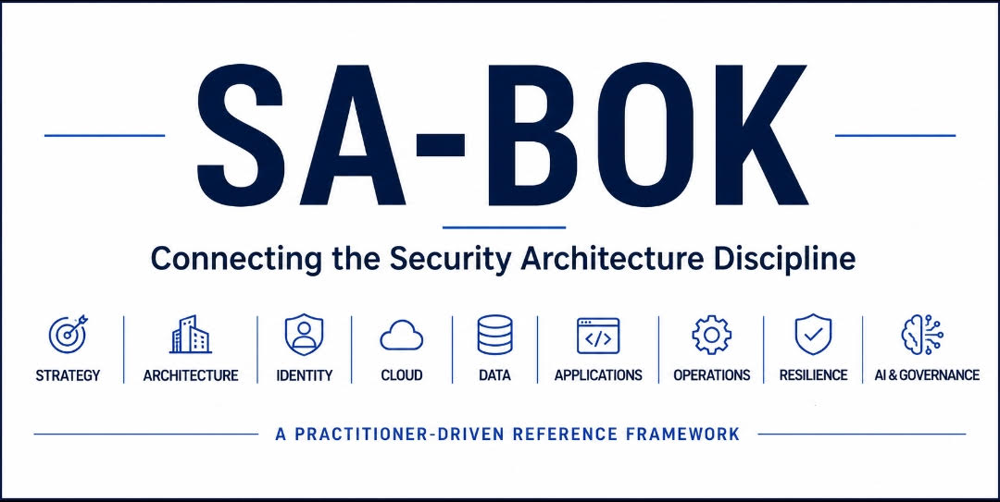

# Security Architecture Body of Knowledge (SA-BOK)

A practitioner-driven reference framework that consolidates the domains, capabilities, and knowledge areas of modern Security Architecture into a single, structured body of knowledge.

Designed for Security Architects, Enterprise Architects, CISOs, Consultants, and Assurance Professionals seeking a holistic view of the Security Architecture discipline.

---

## Why SA-BOK?

Security Architecture knowledge is often distributed across multiple frameworks, standards, methodologies, vendor guidance, and operational practices.

While practitioners may be familiar with individual domains such as Identity, Cloud, Data, Application Security, Security Operations, AI, and Governance, there is often no single reference that brings these disciplines together in a structured and architecture-focused manner.

SA-BOK was created to provide that consolidated view.

It is not intended to replace existing frameworks or standards. Instead, it serves as a practitioner-focused reference model that helps connect concepts, identify capability gaps, support learning, and strengthen Security Architecture practices.

## Who Is It For?

SA-BOK is intended for:

- Security Architects
- Enterprise Architects
- CISOs and Security Leaders
- Cybersecurity Consultants
- Security Assurance Professionals
- Governance, Risk & Compliance Teams
- Security Engineering and Platform Teams
  
It can be used as a reference guide, capability assessment framework, learning roadmap, and architecture discussion tool.

## How To Use SA-BOK

SA-BOK can be used to:

- Understand the breadth of modern Security Architecture
- Assess organizational architecture capabilities
- Identify knowledge and capability gaps
- Support architecture reviews and transformation programmes
- Guide Security Architecture career development
- Establish common terminology across architecture teams
- Structure Security Architecture operating models

---

## Download

The complete SA-BOK v1.0 framework contains:

- 15 Domains
- 150+ Subdomains
- 500+ Topics

📄 Download the full framework:

📄 [Download SA-BOK v1.0 PDF](./SABOK_MindMap_v1.0.pdf)

---

## Domains

### 1. Governance & Strategy

### 2. Enterprise Architecture

### 3. Identity & Trust

### 4. Cloud & Platform Security

### 5. Data Security

### 6. Application Security

### 7. Network & Connectivity

### 8. Security Operations

### 9. Infrastructure & Endpoint Security

### 10. Resilience & Recovery

### 11. AI Security

### 12. Emerging Technologies

### 13. Integration Architecture

### 14. Leadership & Consulting

### 15. Architecture Foundations

---

## Roadmap

Future releases and deep dives will further expand key Security Architecture domains including:

- Identity & Trust
- Cloud & Platform Security
- AI Security
- Data Security
- Security Operations and more...

Additional practitioner guidance, reference architectures, capability mappings, and maturity considerations will be introduced over time.

## Community Feedback

SA-BOK is a practitioner-driven initiative and will continue to evolve through industry feedback, real-world experience, and community contributions.

---

## Author

**Balasubramani S**

Cybersecurity Assurance Consultant | Security Architecture Practitioner

GitHub:
https://github.com/balachrist

LinkedIn:
www.linkedin.com/in/balachrist

---

## Disclaimer

SA-BOK is a practitioner-driven reference framework intended to support Security Architecture learning, capability development, governance, and assurance activities.
